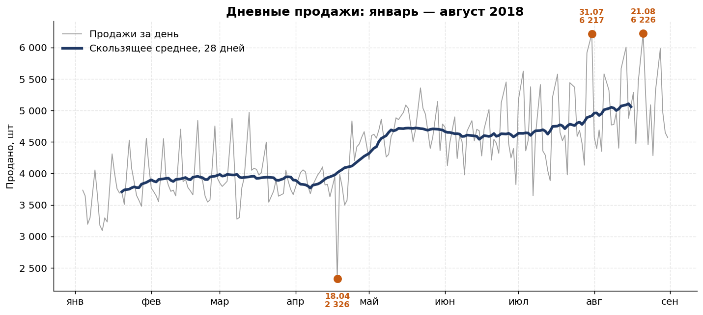
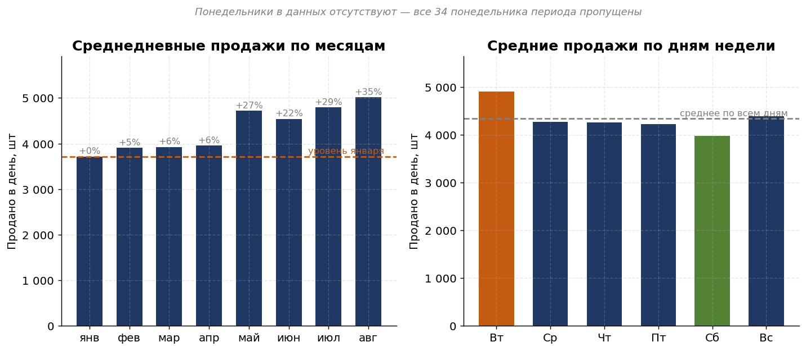
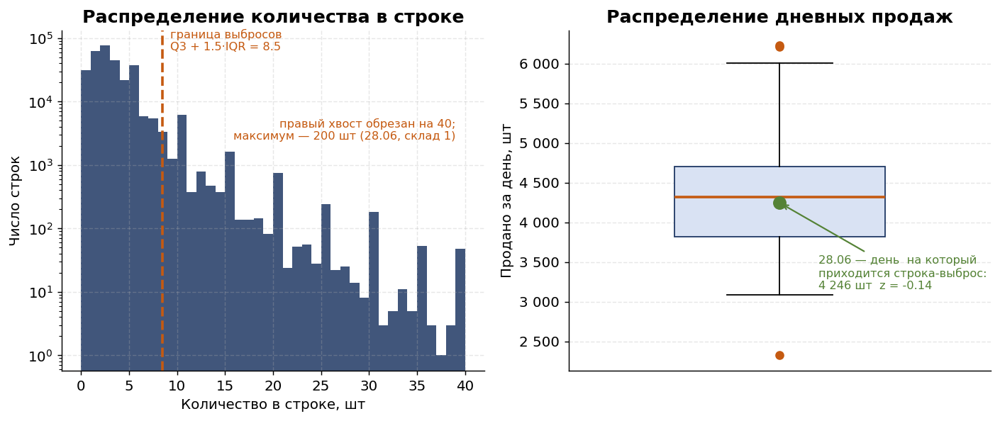
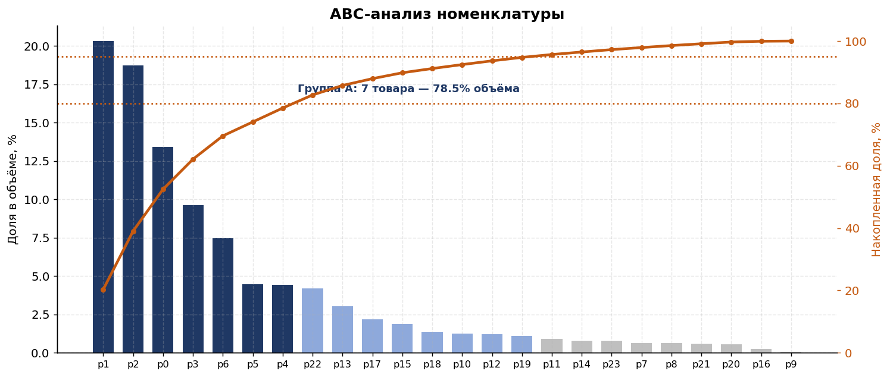
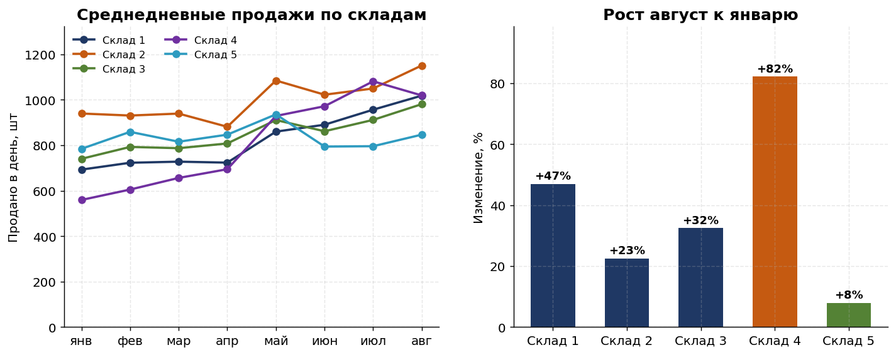
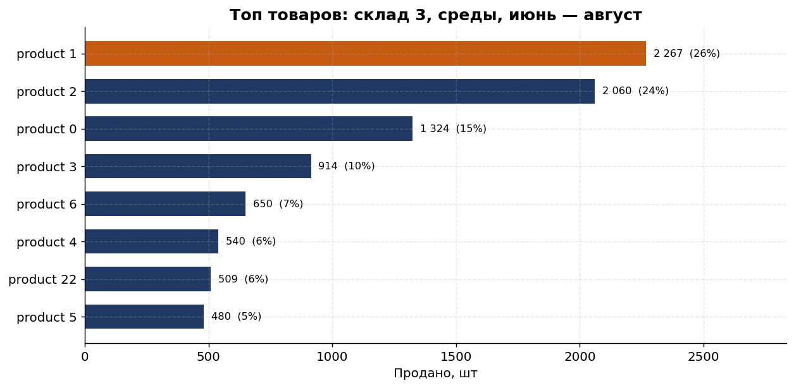
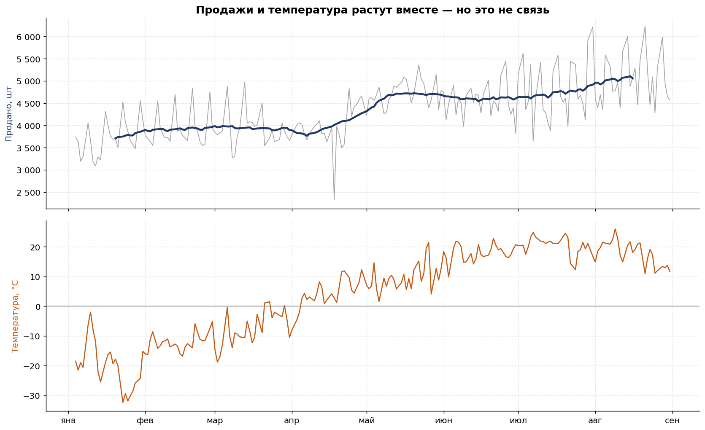
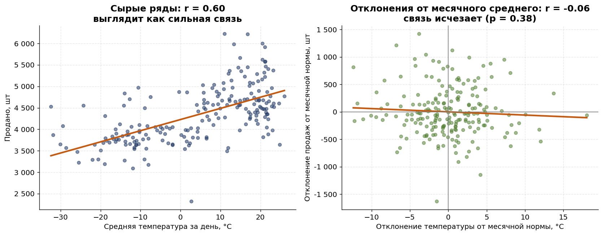
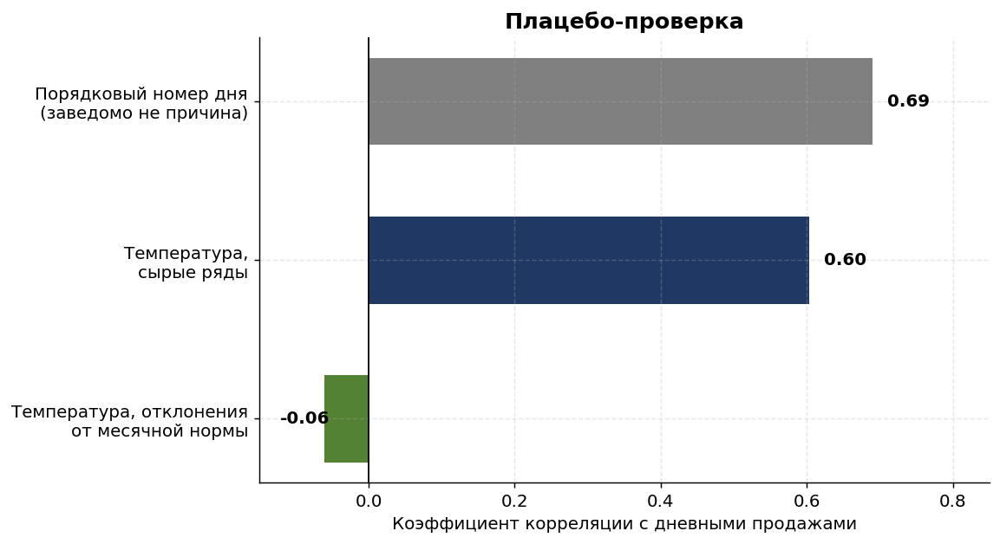

# Продажи дистрибьютора: что стоит за ростом на 35%

Разбор отгрузок за январь — август 2018: 301 355 строк, 5 складов, 211 контрагентов, 24 позиции номенклатуры, 889 467 единиц продукции.

**Вопрос:** продажи выросли на 35%. За счёт чего именно — и правда ли, что спрос зависит от погоды?

**Стек:** Python — pandas, NumPy, Matplotlib, seaborn, SciPy.

---

## Выводы

### Рост на 35% — это одна ступенька, а не тренд

Скользящее среднее держится около 3 900 единиц в день с января по двадцатые числа апреля, затем за две недели поднимается до 4 700 и дальше растёт медленно.

Точка перелома найдена перебором всех разбиений ряда — **24.04.2018**. Среднедневные продажи: 3 878 в январе — апреле против 4 769 в мае — августе, разница 23% (t-критерий Уэлча, t = −13.6, p ≈ 2·10⁻³⁰).



### Вырос размер отгрузки, а не число клиентов

| Показатель | мар — апр | май — июн | Изменение |
|---|---|---|---|
| Строк в день | 1 440 | 1 470 | +2.1% |
| Среднее в строке, шт | 2.74 | 3.15 | **+15.2%** |
| Активных контрагентов | 192 | 199 | +3.6% |
| Продано в день, шт | 3 939 | 4 632 | +17.6% |

Прирост объёма почти целиком объясняется размером отгрузки. Из 211 контрагентов 197 присутствуют с января, за восемь месяцев добавилось 14 новых. Привлечения не было — те же клиенты стали брать больше за раз.

### Понедельников в данных нет вообще

Из 240 календарных дней периода в данных 205. Пропущены все 34 понедельника плюс один четверг — 22.03.2018.

Это не потеря данных, а режим работы. Следствие: любое «среднее за неделю» считается по шести дням, а вторничный пик (+13% к среднему) объясняется отложенным за выходной спросом. Суббота — минимум, −8%. Разрыв между лучшим и худшим днём недели 23%.



### Аномальная строка и аномальный день — разные вещи

Максимум по массиву — 200 единиц, 28.06, склад 1, контрагент address_208 (закупался всего 6 дней за период). Это в 68 раз выше медианы строки.

Но **день 28.06 совершенно обычный**: 4 246 единиц, z-оценка −0.14, ниже среднего. Строка-выброс составляет 4.7% дневного объёма и на уровне дня не видна.

По правилу Тьюки на уровне строки выбросами оказываются 13 140 строк (4.4%), дающих 19.1% объёма. На уровне дня выбросов всего три: 18.04 (минимум, 2 326), 31.07 (6 217) и 21.08 (максимум, 6 226).

Практический вывод: уровень агрегации для поиска выбросов нужно выбирать под то решение, которое принимается по результату. Аномальная строка — вопрос к сделке и клиенту, аномальный день — вопрос к загрузке склада.



### Неудовлетворённый спрос сокращается

10.4% строк содержат нулевое количество — позиция была в заявке, но не отгружена. Доля монотонно падает с 14.3% в январе до 8.3% в августе и сильно различается по товарам: от 6.4% у product_1 до 23.3% у product_12.

Часть роста продаж может объясняться улучшением наличия товара, а не ростом спроса. Это отдельная гипотеза, которую стоит проверить на данных об остатках.

### Структура: товары концентрированы, клиенты — нет

Семь товаров из 24 формируют 78.5% объёма (группа A). Топ-3 — product_1 (20.3%), product_2 (18.7%), product_0 (13.4%).

Клиентская база, наоборот, распределена ровно: топ-10 контрагентов из 211 дают лишь 13.5% объёма, топ-50 — 45.1%. Медиана (3 827) близка к среднему (4 215) — выраженного ядра крупных клиентов нет. Это устойчиво к потере клиента, но означает, что точек роста через ключевых клиентов немного.



### Склады растут неравномерно

Доли в объёме почти равны — от 18.9% до 23.1%. А темпы роста различаются в 10 раз: склад 4 прибавил 82% к январю, склад 5 — только 8%.



### Топовый товар: склад 3, среды, июнь — август

**product_1 — 2 267 шт, 21.6% объёма среза.** Отрыв от product_2 всего 10%, а сред в выборке только 13, так что лидерство неуверенное.

Проверка на других срезах показывает, что product_1 лидирует везде: по всем складам, по всем дням недели, на всём периоде. Узкий срез не выявляет локальной специфики — он воспроизводит общего лидера продаж.



---

## Гипотеза о влиянии погоды: не подтвердилась

Данные о температуре: открытый архив Open-Meteo (реанализ ERA5), Астана, 51.14 N / 71.42 E, 240 дней, пропусков нет.

Продажи растут с января по август. Температура за те же месяцы растёт с −33 °C до +26 °C. Корреляция двух рядов, которые оба растут во времени, будет высокой независимо от того, связаны они причинно или нет.



### Три расчёта вместо одного

| Что считаем | r | p-value | Вывод |
|---|---|---|---|
| Сырые ряды: температура и продажи | **0.60** | 9·10⁻²² | связь сильная и значимая |
| Отклонения от месячного среднего | **−0.06** | 0.38 | связи нет |
| Порядковый номер дня и продажи (плацебо) | **0.69** | 2·10⁻³⁰ | — |

**Сырые ряды дают r = 0.60.** Формально — сильная значимая связь. Это и был бы ответ, если остановиться здесь.

**Отклонения от месячного среднего дают r = −0.06 (p = 0.38).** Общий сезонный ход вычтен из обоих рядов, и остаётся вопрос по существу: отличаются ли тёплые дни от холодных *внутри одного месяца*. Не отличаются — связь исчезает полностью, знак меняется на противоположный.



**Плацебо-проверка объясняет, почему так.** Порядковый номер дня коррелирует с продажами на r = 0.69 — *сильнее*, чем температура. Номер дня физически не может влиять на спрос. Значит, обе корреляции измеряют одно и то же: календарь.



### Дополнительные контроли

- Частная корреляция температуры и продаж при фиксированном номере дня: **r = −0.08 (p = 0.23)**
- После вычета месяца и дня недели: **r = −0.04 (p = 0.57)**

Ни одна оценка не отличается от нуля значимо.

Причина в том, что температура сама на **90.5%** объясняется месяцем — она почти целиком является календарём, а не самостоятельным фактором. Месячный уровень при этом объясняет 52.1% дисперсии дневных продаж. Именно это пересечение наивная корреляция и принимает за влияние погоды.

**Вывод: погода на продажи не влияет.** Рост на 35% объясняется тем, что произошло 24 апреля, а не потеплением.

---

## Структура репозитория

| Файл | Назначение |
|---|---|
| `sales_analysis.ipynb` | Основной ноутбук: 46 ячеек, весь анализ с комментариями |
| `make_figures.py` | Построение графиков для README |
| `verify_notebook.py` | Автопроверка: исполняет все ячейки и сверяет числа с прямым расчётом |
| `data/data.csv` | Исходные данные отгрузок |
| `data/weather_astana_2018.csv` | Средняя суточная температура, Астана, Open-Meteo |
| `figures/` | Графики |
| `requirements.txt` | Версии библиотек |

## Как воспроизвести

```bash
pip install -r requirements.txt
jupyter notebook sales_analysis.ipynb
```

Проверка расчётов:

```bash
python verify_notebook.py
```

Скрипт исполняет все 25 кодовых ячеек и сверяет 22 ключевых значения с независимым расчётом на исходных данных. Расхождение любого числа роняет проверку.

---

## Замечания к методу

**Нули не удалялись.** Строка с нулевым количеством — это зафиксированный неудовлетворённый спрос, а не ошибка. Их удаление завысило бы средний размер отгрузки примерно на 11%.

**Выбросы не удалялись, а анализировались.** Крупная разовая закупка — это не ошибка данных, а реальная сделка. Удалять её означало бы скрыть от бизнеса существование таких клиентов.

**Точка перелома найдена перебором, а не выбрана на глаз.** Максимизируется модуль t-статистики по всем разбиениям ряда. Такой перебор завышает значимость, поэтому p-value из этой процедуры нельзя интерпретировать буквально — здесь она использована только для локализации даты, а значимость сдвига проверена отдельно на фиксированной границе 1 мая.

**Корреляция не означает причинность** — и на этих данных это не абстрактная оговорка. Наивный расчёт даёт r = 0.60 и уверенный вывод «спрос зависит от погоды». Правильный расчёт даёт r = −0.06. Разница между этими двумя ответами — вся ценность анализа.
